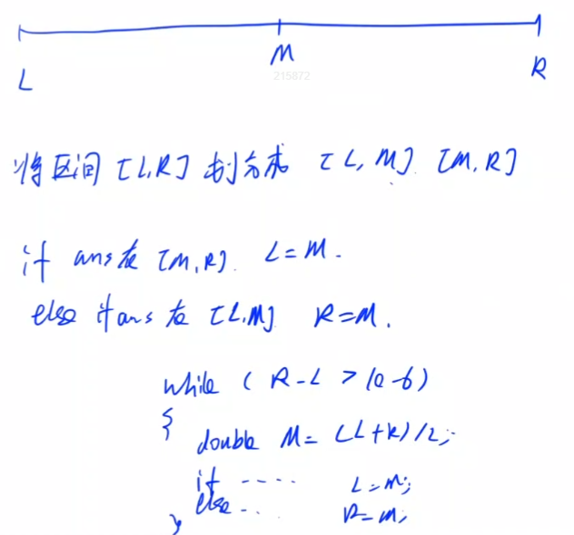

## 第一讲 递归与递推


## 第二讲 二分与前缀和

### 整数二分

1. 确定一个区间 使得目标值一定在区间中
2. 找一个性质，满足：
   1. 性质具有二段性
   2. 答案是二段性的分界点


第一类：ans是红色区间的右端点
将[L,R]分成[L,M-1] [M,R]

if M是红色的 说明ans必然在[M,R]

else 说明ans必然在[L,M-1]

```
while(L < R) {
	M = (L + R + 1) / 2;
	if (M红) {
		L = M;
	} else {
		R = M - 1;
	}
}
```


第二类：ans是绿色区间的左端点

将[L,R]分成[L,M] [M+1,R]

if M是绿色的 说明ans必然在[L,M]

else 说明ans必然在[M+1,R]

```
while(L < R) {
	M = (L + R) / 2;
	if (M绿) {
		R = M;
	} else {
		L = M + 1;
	}
}
```


整数二分步骤：

1. 找一个区间[L,R]，使得答案一定在该区间中。
2. 找一个判读条件，使得该判断条件具有二段性，并且答案一定是该二段性的分界点。
3. 分析中点M在该判断条件下是否成立，如果成立 ，考虑答案在哪个区间；如果不成立，考虑答案在哪个区间。
4. 如果更新方式写的是R = Mid，则不用做任何处理；如果更新方式写的是L = Mid，则需要在计算Mid时加上1。


### 实数二分

```
while(R - L > 1e-6)
```




### 前缀和

S0 = 0

Sj = a1 + a2 + ... + aj

Sn = a1 + a2 + ... + an

aL + aL+1 + aL+2 + ... + aR = SR - SL-1


## 第三讲 数学与简单DP

01背包问题

从集合角度来分析DP问题（闰氏DP分析法）


## 第四讲 枚举、模拟与排序
