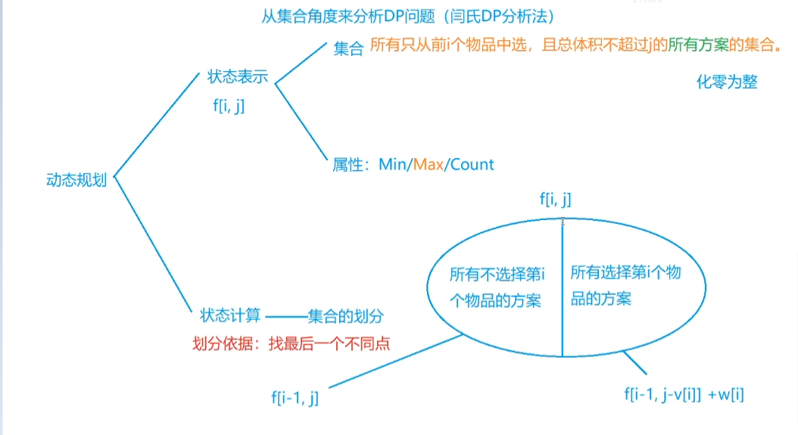
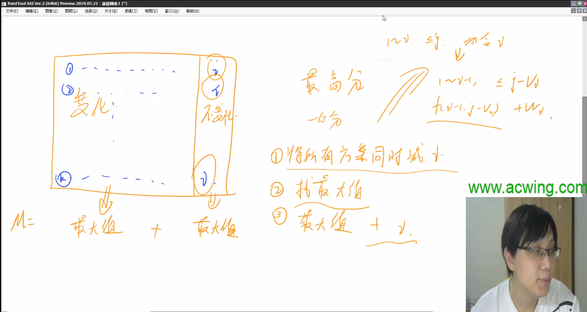
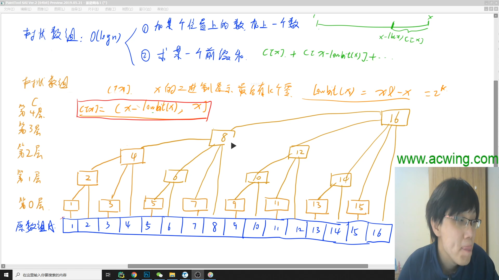
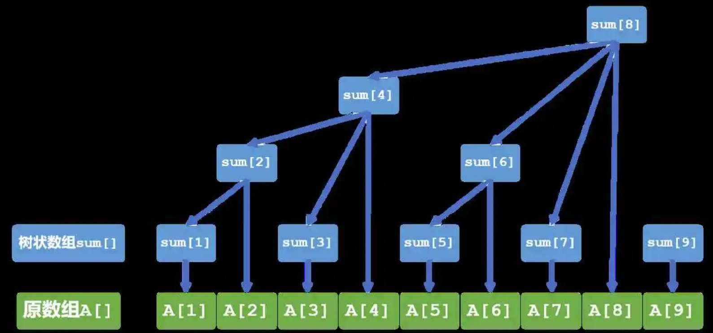
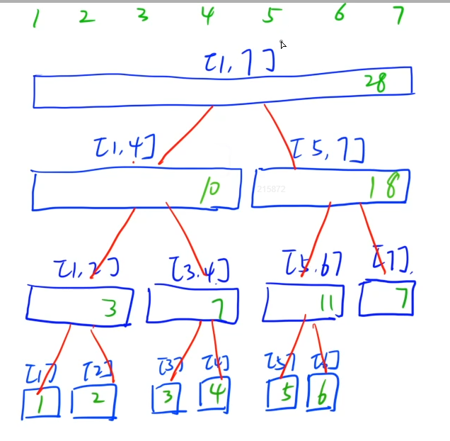
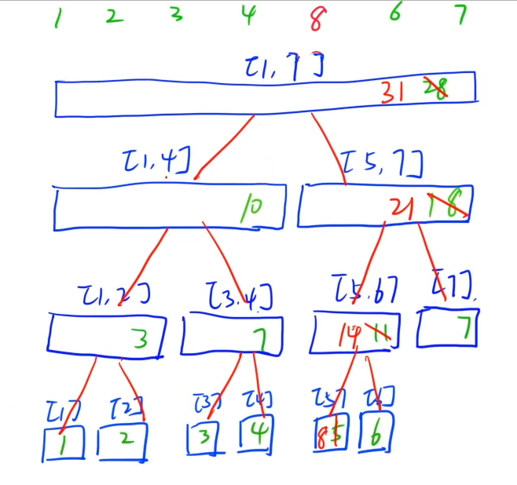
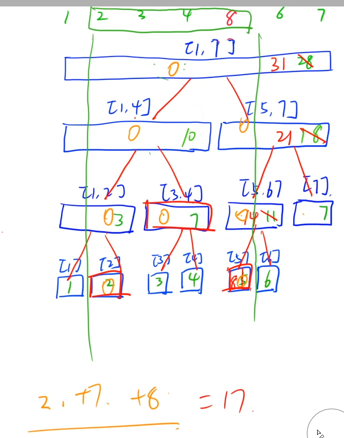
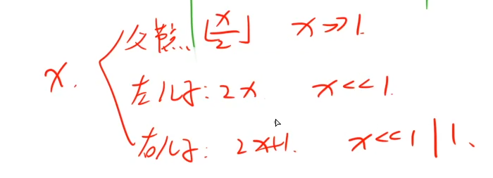

## 第一讲 递归与递推


## 第二讲 二分与前缀和

### 整数二分

1. 确定一个区间 使得目标值一定在区间中
2. 找一个性质，满足：
   1. 性质具有二段性
   2. 答案是二段性的分界点


第一类：ans是红色区间的右端点
将[L,R]分成[L,M-1] [M,R]

if M是红色的 说明ans必然在[M,R]

else 说明ans必然在[L,M-1]

```
while(L < R) {
	M = (L + R + 1) / 2;
	if (M红) {
		L = M;
	} else {
		R = M - 1;
	}
}
```


第二类：ans是绿色区间的左端点

将[L,R]分成[L,M] [M+1,R]

if M是绿色的 说明ans必然在[L,M]

else 说明ans必然在[M+1,R]

```
while(L < R) {
	M = (L + R) / 2;
	if (M绿) {
		R = M;
	} else {
		L = M + 1;
	}
}
```


整数二分步骤：

1. 找一个区间[L,R]，使得答案一定在该区间中。
2. 找一个判读条件，使得该判断条件具有二段性，并且答案一定是该二段性的分界点。
3. 分析中点M在该判断条件下是否成立，如果成立 ，考虑答案在哪个区间；如果不成立，考虑答案在哪个区间。
4. 如果更新方式写的是R = Mid，则不用做任何处理；如果更新方式写的是L = Mid，则需要在计算Mid时加上1。


### 实数二分

```
while(R - L > 1e-6)
```


### 前缀和

S0 = 0

Sj = a1 + a2 + ... + aj

Sn = a1 + a2 + ... + an

aL + aL+1 + aL+2 + ... + aR = SR - SL-1


## 第三讲 数学与简单DP

### 02. 01背包问题

从集合角度来分析DP问题（闰氏DP分析法）





1015. 摘花生


895. 最长上升子序列


## 第四讲 枚举、模拟与排序


### 递增三元组

数据范围为1≤N≤10^5^ ,因此猜测时间复杂度为O(nlogn)=>最多枚举一个数组，因此暴力三重循环是不可行的。

思路：A~i~ < B~j~ < C~k~ => 对于每个B~j~都有

1. 在A中有多少个小于B~j~
2. ②在C中有多少个大于B~j~

方法1:`前缀和`

cnt[i]表示在A中，i这个值出现多少次

用s[]做cnt[]的前缀和，s[i]表示在A中0~i出现多少次


方法2：`sort`+`二分`


~~方法3:~~


## 第四讲 枚举、模拟与排序


## 第五讲 树状数组与线段树

### `树状数组`：O(logn)

1. 加某个位置上的数，加上一个数 `单点修改`
2. 求某一个前缀和 `区间查询`





代码：

```java
int res = 0;
for (int i = x; i > 0; i -= lowbit(i)) {
	res += c[i];
}
return res;
```

一些固定写法：

```java
    public static int lowbit(int x) {
        return x & -x;
    }

    public static void add(int x) {
        for (int i = x; i < N; i += lowbit(i)) {
            tree[i]++;
        }
    }

    public static int sum(int x) {
        int res = 0;
        for (int i = x; i > 0; i -= lowbit(i)) {
            res += tree[i];
        }
        return res;
    }
```

### `线段树`



1. 单点修改O(logn)



2. 区间查询O(logn)



核心函数：

- pushup：用子节点信息更新当前节点信息
- build：在一段区间初始化线段树
- modify：修改
- query：查询
- ~~pushdown：带懒标记的操作~~




### 逆序对

若有k个逆序对，就会交换k次


### 螺旋折线


## 第六讲 双指针、BFS与图论


